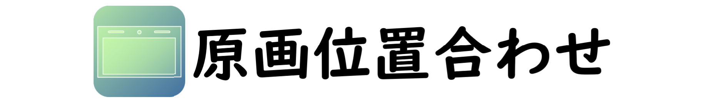
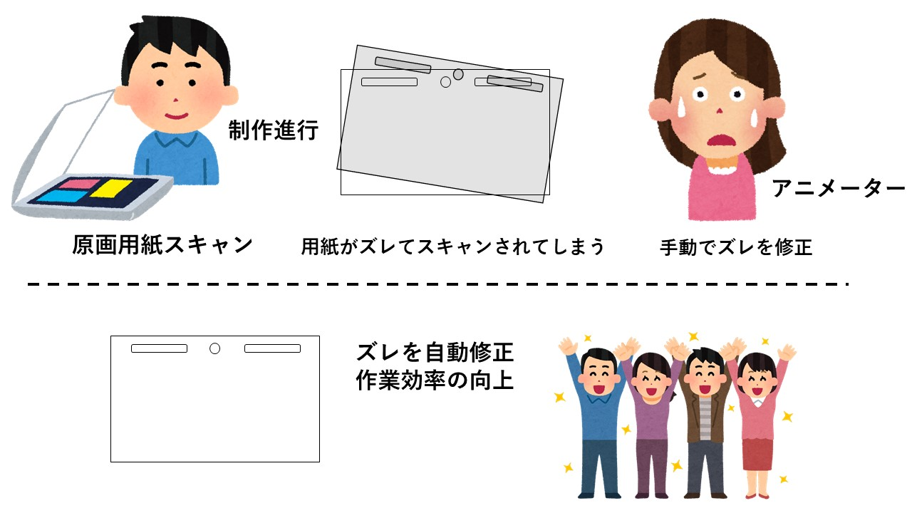
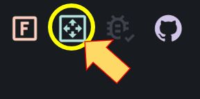

スキャンされた原画やレイアウト用紙のタップ穴・フレームを基準に位置合わせを自動で行います

[![license][license-badge]](LICENSE)
[![version][version-badge]](https://keyframe-refiner.js.org)
[![build status][github-action-badge]](https://github.com/keyframe-refiner/keyframe-refiner/actions/workflows/deploy.yml)
[![OSS life cycle][osslifecycle-badge]](https://github.com/keyframe-refiner/keyframe-refiner)

## 使用方法
0. [原画位置合わせ (https://keyframe-refiner.js.org)](https://keyframe-refiner.js.org)　にアクセス

1. モードを選択  
    以下のモードを選択できます
    - タップ穴を基準にする
    - フレームを基準にする

2. 原画を追加
    - **画面左サイドバーにある「+」ボタンを押すか、ファイルをドラッグ＆ドロップ**
    - **位置合わせしたい原画を全て選択**
3. 基準画像選択
    - **画面右サイドバーにある「表示中の画像を基準に設定」ボタンを押す**
    - 1 枚目の画像を基準にしたい場合はそのままボタンを押す
    - もし基準画像を変更したい場合には左サイドバーに表示されているサムネイルを押すと変更可能
4. 対象領域設定
    - **左クリックで検出する対象領域を指定**
     【!注意!】 
    選択したモードによって対象領域設定が変わります 
        - **タップ穴を基準とした場合**  
        タップ穴(３つの穴)が全て入るように領域を指定
        - **フレームを基準とした場合**  
        フレームが全て入るように領域を指定

5. 基準位置設定
    - **右サイドバーにある「自動算出」ボタンを押す**
    - もし自動算出された位置が不適当である場合、手動で変更も可能
    - **基準位置が適当であれば、「基準位置を設定」ボタンを押す**
     【!注意!】 
    選択したモードによって基準位置が変わります 
        - **タップ穴を基準とした場合**  
        タップ穴の中央穴が基準位置となります
        - **フレームを基準とした場合**  
        フレームの中央が基準位置となります

6. OpenCV 処理
    - **「CV 処理開始」ボタンを押す**
    - **CV 処理終了後に「ダウンロード」ボタンを押す**

     **「検出できませんでした」と表示された場合**  
    対象領域が狭いことが原因と考えられます。対象領域を広くして再度「CV処理開始」ボタンを押してください。

## デバッグモード
出力時にどこを検出したのかを描画してくれます。結果不良の原因となる検出の誤判定を確認することができます。画面右上の「虫」マークを押すとデバッグモードがONになります。 

      
    デバッグモードアイコン

## フレームサイズ合わせ機能
スキャン時の歪みを基準画像のフレームを元に補正します。「フレームを基準とした場合」に、画面右上に表示されるアイコンを押すとONになります。 

      
    フレームサイズ合わせ機能

## オフライン動作可能
[原画位置合わせ](https://keyframe-refiner.js.org)に初回アクセスして以降はオフラインでも同ブラウザであれば動作が可能です。オフライン時でも、ブラウザから「`https://keyframe-refiner.js.org`」と入力すると起動することができます。ただし，一度も本Webアプリにアクセスしていないブラウザからは動作することができません。

## アルゴリズム
1. 前処理（ブラー、二値化）
2. 全ての原画のサイズを余白追加によって統一
3. 対象領域にあるタップ穴を検知
4. 中央穴を基準に平行移動、左穴と中央穴の角度を求めて回転

## 注意事項
適切な対象領域の設定をしなければ自動位置合わせが上手くいかない場合があります。以下の 2 点に注意して下さい。
- タップ穴がぎりぎりに含まれるような対象領域に設定しない
- 対象領域に文字や線が混入させない
- 3つのタップ穴の全てを対象領域内にいれる

## ライセンス
[MIT](LICENSE)

[license-badge]: https://img.shields.io/github/license/keyframe-refiner/keyframe-refiner?color=blue
[version-badge]: https://img.shields.io/github/package-json/v/keyframe-refiner/keyframe-refiner/master
[github-action-badge]: https://img.shields.io/github/workflow/status/keyframe-refiner/keyframe-refiner/Deploy%20to%20GitHub%20Pages?
[osslifecycle-badge]: https://img.shields.io/osslifecycle/keyframe-refiner/keyframe-refiner
